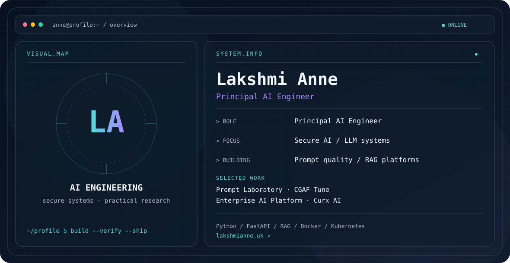

<picture>
  <source media="(prefers-color-scheme: dark)" srcset="./dark.svg">
  <source media="(prefers-color-scheme: light)" srcset="./light.svg">
  
</picture>

## Hi, I'm Lakshmi

I'm a Principal AI Engineer working on secure, reliable AI systems. My interests span LLM applications, evaluation, evidence grounded generation, backend architecture, and AI security. I build tools that make AI workflows easier to test, govern, and operate.

### Professional experience

**Principal AI Engineer · Axiom GRC (WorkNest) · 2026–present**  
Architecting secure AI capabilities for enterprise cybersecurity products, with a focus on reliable agentic systems and production-ready LLM applications. Building evaluation, security, and observability into AI systems to support dependable production use. Working with Python, FastAPI, LangGraph, AWS Bedrock, Claude, and PostgreSQL across AI services and backend platforms.

**AI and ML engineering across industries · 2016–2026**

| Client | Work |
| --- | --- |
| HSBC · 2025–2026 | Real time fraud detection with streaming data, ML models, and risk scoring APIs. |
| Marriott International · 2022–2024 | Guest review analysis and AI assisted hospitality insights. |
| Tesco · 2021–2022 | Demand forecasting and recommendation systems. |
| StormGeo · 2018–2021 | Storm impact forecasting with weather and claims data. |
| Flipkart · 2016–2018 | Computer vision for phone damage assessment. |

### Education and certifications

MSc Finance, University of Hertfordshire (2024). Microsoft Azure AI Engineer Associate, Google Cloud Professional ML Engineer, and AWS Machine Learning Specialty.

### Featured projects

| Project | What it explores |
| --- | --- |
| [Prompt Laboratory](https://github.com/Anne07-Ai/prompt-laboratory) | Git native prompt versioning, testing, evaluation, and release workflows. |
| [CGAF Tune](https://github.com/Anne07-Ai/cgaf-tune) | Fine tuning and evaluation work. |
| [Enterprise AI Platform](https://github.com/Anne07-Ai/enterprise-ai-platform) | Reference architecture for enterprise RAG and AI services. |
| [Curx AI](https://github.com/Anne07-Ai/Curx-AI) | Job discovery, evaluation, and grounded CV tailoring. |

### Areas I work in

`Python` · `FastAPI` · `LLM applications` · `RAG` · `AI evaluation` · `AI security` · `Docker` · `Kubernetes`

### Connect

[Portfolio](https://lakshmianne.uk) · [LinkedIn](https://www.linkedin.com/in/lakshmi-anne-b16420342/) · [Email](mailto:hello@lakshmianne.uk)
